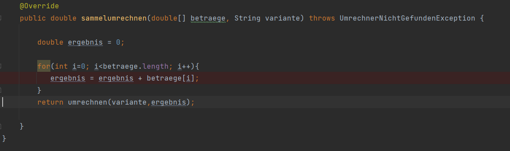

##Chain of Responsibility
Je nach Zuständigkeit werden Methoden mit der Chain of Responsibility an verschiedene Umrechner weitergegeben.

Hier nochmal in einem ER-Diagramm dargestellt

##Template Hook

Code-dublikate sollen verhindert werden. 
Bemerkung: Aufgaben wurden mit Hilfe von Kollegen gelöst.
Verbesserungen im Code wurden durchgeführt. 

Exception hinzugefügt:

Neue Main:

ER-Diagramm danach:

##Decorater
Umrechnungsfunktionlitäten werden erweitert
Zusätzliche Funktionen sollen nicht in die Vorhandenen Umrechner eingreifen.

Aufgaben:
a)  Belegung eines Umrechnungsvorganges mit Gebühren (z.B. 0,5 % des Umrechnungsbetrages)

b)  Belegung eines Umrechnungsvorganges für Umrechnungen von Euro nach Währung X (nicht in die
    andere Richtung) mit fixen Gebühren von 5 Euro.

##Builder
(Folgt)

## Adapter
Es beschreibt eine Adapter-Klasse, die die Kooperation ansonsten inkompatibler Klassen und Interfaces ermöglicht. 
Dies geschieht in Java durch Erweiterung einer Klasse und/oder Implementieren eines Interfaces.

SA ist hier die Adapter Klasse

##Observer

Ein Beobachter und ein Subjekt.
Nutzen:
- Subjekt informiert Beobachter falls sich der Zustand des Subjekts ändert.
- Pull:
  - Beobachter holt sich die Information, sobald sich der Zustand geändert hat.
- Push:
  - Beide Informationen werden sofort mitgesendet.

