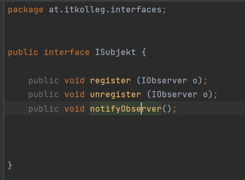

#SOLID und Modulierungen
„S“ wie „Single-Responsibility-Prinzip“
Die Kernaussage des Prinzips ist, dass jede Klasse nur genau eine fest definierte Aufgabe zu erfüllen hat

„O“ wie „Open-Closed-Prinzip“
Dieses Prinzip besagt, dass Klassen, Methoden, Module et cetera so entwickelt werden sollen, dass sie einfach zu erweitern sind – ohne aber ihr Verhalten zu ändern.

„L“ wie „Liskovsches Substitutionsprinzip“
Das (Ersetzungs-)Prinzip sagt aus, dass eine Subklasse immer alle Eigenschaften der Superklasse erfüllen und immer als Objekt der Superklasse verwendbar sein muss.

„I“ wie „Interface-Segregation-Prinzip“
Wie der Name erahnen lässt, geht es hierbei darum, Interfaces aufzuspalten beziehungsweise sie nicht unnötig groß zu machen.

„D“ wie „Dependency-Inversion-Prinzip“
In Modulen, die eine höhere Hierarchie innerhalb der Software aufweisen, werden generelle Abläufe beschrieben, die von spezielleren Modulen verwendet werden.

Quelle: https://t3n.de/news/prinzipien-software-entwicklung-solid-615556/

## Table of Contents
1.[Chain of Responsibility](#chain_of_responses)
2.[Template Hook](#template_hook)
3.[Decorater](#decorater)
4.[Builder](#builder)
5.[Adapter](#adapter)
6.[Observer](#observer)

## Chain of Responsibility 
Je nach Zuständigkeit werden Methoden mit der Chain of Responsibility an verschiedene Umrechner weitergegeben.

Hier nochmal in einem ER-Diagramm dargestellt

## Template Hook 

Code-dublikate sollen verhindert werden. 
Bemerkung: Aufgaben wurden mit Hilfe von Kollegen gelöst.
Verbesserungen im Code wurden durchgeführt. 

Exception hinzugefügt:

Neue Main:

ER-Diagramm danach:

## Decorater
Umrechnungsfunktionlitäten werden erweitert
Zusätzliche Funktionen sollen nicht in die Vorhandenen Umrechner eingreifen.

Aufgaben:
a)  Belegung eines Umrechnungsvorganges mit Gebühren (z.B. 0,5 % des Umrechnungsbetrages)

b)  Belegung eines Umrechnungsvorganges für Umrechnungen von Euro nach Währung X (nicht in die
    andere Richtung) mit fixen Gebühren von 5 Euro.

## Builder
(Folgt)

## Adapter 
Es beschreibt eine Adapter-Klasse, die die Kooperation ansonsten inkompatibler Klassen und Interfaces ermöglicht. 
Dies geschieht in Java durch Erweiterung einer Klasse und/oder Implementieren eines Interfaces.

SA ist hier die Adapter Klasse

## Observer 

Ein einzelner 'Erzähler' möchte, 
dass eine von ihm gesandte Nachricht von einer beliebigen Vielzahl von 'Zuhörern' wahrgenommen wird.
"https://javabeginners.de/Design_Patterns/Observer_-Pattern.php"

Ein Beobachter und ein Subjekt.
Nutzen:
- Subjekt informiert Beobachter falls sich der Zustand des Subjekts ändert.
- Pull:
  - Beobachter holt sich die Information, sobald sich der Zustand geändert hat.
- Push:
  - Beide Informationen werden sofort mitgesendet.
  

